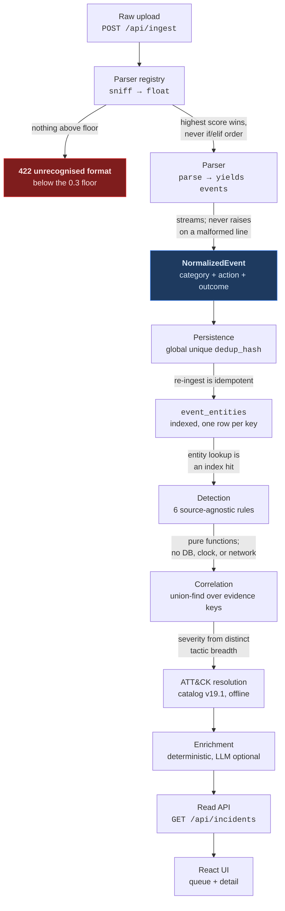
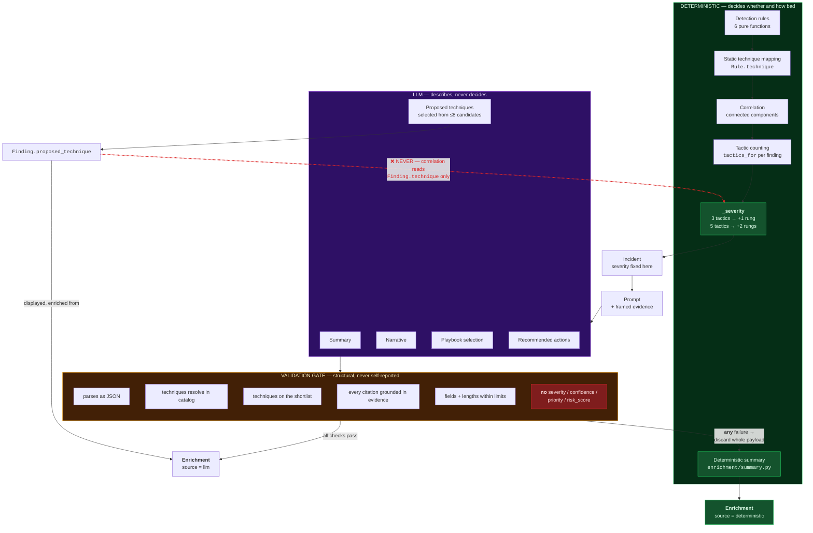

# Architecture

How a raw log line becomes a scored incident, and where the language model is
allowed to touch it. [CLAUDE.md](CLAUDE.md) records *why* each decision was made
and what was rejected; this file is the shape of the thing.

## Pipeline

Each stage guarantees something the next relies on; the edge labels are those
guarantees.

Two things this diagram flattens. Detection runs over **persisted** events, not
parser output — dedup is part of the semantics, so rules run on fresh parses
would double-count and disagree with production. And incidents are **computed
on read**: there is no incidents table, so `GET /api/incidents` replays
`events → run_rules → correlate` per request and the queue cannot disagree with
the rules in the tree. That is also the first thing to break under real volume.

## The AI boundary

The load-bearing diagram. Everything deciding *whether* and *how bad* is
deterministic; the model only describes what that code already found.

**Read the dashed red edge first.** A model-proposed technique lands in
`Finding.proposed_technique`, a field `_severity` never reads. Severity is a
function of distinct tactic count, so a proposed technique reaching
`Finding.technique` would add a tactic, escalate the incident, and re-score
it — the model doing detection's job without ever writing a number. Validating
the ID does not help: a *valid* wrong technique escalates just as effectively.

**Degradation is visible, not silent.** Every path out of the gate returns an
`Enrichment` — no exception reaches the caller, no `None`. A timeout, a 500, a
malformed body and a hallucinated citation all land on the deterministic summary
with the reason recorded in `failures`, and the response carries
`enrichment_source` so the UI can badge it. `enrich()` is off by default
(`SOC_ENRICHMENT_ENABLED`), so a fresh clone with no API key produces complete
incidents — true only because `summary.py` was written and tested before any
prompt existed. Were it a stub, an outage would not degrade output; it would
break the pipeline.

## The normalized event schema

Every parser emits `NormalizedEvent` and nothing downstream sees a source
format. The design is carried not by a field but by a triple: **`category` +
`action` + `outcome`**, rather than a flat `event_type`.

A flat type forces the enum to name the cross product. `ssh_login_failed`,
`console_login_failed` and `windows_logon_failed` are three constants for one
idea, and a brute-force rule matching all three is three rules wearing a
trenchcoat — adding a source means editing every rule that should have covered
it already. The triple lets a rule subscribe to `Category.AUTHENTICATION` and
ask `outcome is FAILURE`, which is why `BruteForceAuthentication` fires on a
CloudTrail `ConsoleLogin` burst without knowing CloudTrail exists.

It also gives failures somewhere safe to land: an unmapped CloudTrail event
gets `Category.OTHER` and a snake-cased action, and no rule matches it, whereas
a flat type must guess a member of a closed enum. See the `GetCallerIdentity`
case in the README for the invariant test that pins this.

## Entity keys and cross-source correlation

Every event emits namespaced identifiers for the things it touches —
`ip:203.0.113.5`, `user:deploy`, `host:webserver01`,
`principal:arn:aws:iam::…:user/deploy`, `account:123456789012` — stored in
their own indexed table rather than a JSON column, so "everything touching this
address in the last hour" is an index hit rather than a scan. `account:` is its
own namespace and not `host:` because a tenant is not a machine: CloudTrail's
`recipientAccountId` rendered as `host:123456789012` is an asset key naming
something with no asset behind it.

Correlation is **connected components over the keys an incident's evidence
touches**, within a `max_gap` of one hour. One mechanism covers two jobs that
look separate: the three copies of one burst filed under `ip:`, `user:` and
`host:` merge because they share keys, and later CloudTrail activity merges
because it shares `ip:`. Joining is transitive, so an incident can span
entities that never co-occur in a single event.

Not every key is worth joining on, and the filter measures **co-occurrence
breadth, not frequency**. Frequency is the intuitive metric and exactly
backwards: in a batch dominated by one intrusion the attacker's IP is the most
frequent key, so a frequency threshold suppresses the key that should do the
joining. Breadth splits the cases correctly — `user:root` across forty hosts is
ambient, `ip:203.0.113.5` across one host and one account is identifying however
often it appears. Suppressed keys are still recorded on the incident, and
`MAX_COOCCURRING_KEYS = 12` is an unvalidated guess — the first knob to turn.

## The trust boundary

**Log content is attacker-controlled.** `user_agent`, Windows event
descriptions and CloudTrail request fields are all writable by whoever is being
logged, and all reach the prompt. Anything an attacker can put in a log line,
they can address to the model.

Evidence is therefore **framed, never filtered**. `wrap_evidence()` puts raw
lines inside `<evidence>` delimiters, preceded — inside the same block, before
any untrusted text is read — by a standing instruction that the contents are
data and that text appearing to address the reader is attacker-supplied content
to be reported rather than obeyed. The system prompt says so independently.

Filtering was rejected because it fails twice: it cannot enumerate the ways an
instruction can be phrased, and a stripped line is evidence the analyst no
longer sees — handing an attacker a way to delete their own tracks by writing
something that trips the filter. An injection attempt passes through verbatim
and is *reportable*, which is the useful outcome.

One structural exception, and it is not filtering: newlines inside a raw record
are flattened to spaces. A multi-line CloudTrail record could otherwise carry a
`</evidence>` line of its own and push the rest of its content outside the
framing. Flattening removes the forged *delimiter* while preserving every
character of content — the literal `</evidence>` still appears inline, inert.
Truncation (40 lines, 400 chars each) bounds prompt occupancy, not content.
